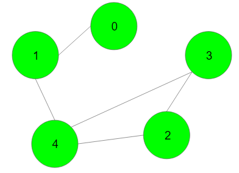
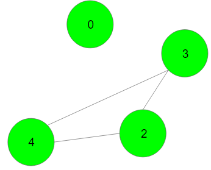
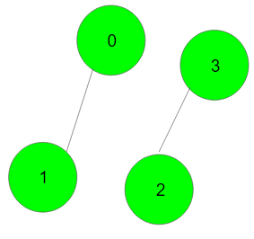

# **Articulation Point - I**

## **Hard**

Given an undirected connected graph with **V** vertices and adjacency list **adj**. You are required to find all the vertices removing which (and edges through it) disconnects the graph into 2 or more components.  
**Note:** Indexing is zero-based i.e nodes numbering from (0 to V-1). There might be loops present in the graph.

**Example 1:**

```
Input:
```



```
Output:{1,4}
Explanation: Removing the vertex 1 will
discconect the graph as-
```



```
Removing the vertex 4 will disconnect the
graph as-
```



**Your Task:**  
You don't need to read or print anything. Your task is to complete the function **articulationPoints()** which takes V and adj as input parameters and returns a list containing all the vertices removing which turn the graph into two or more disconnected components in sorted order. If there are no such vertices then returns a list containing -1.

**Expected Time Complexity:** O(V + E)  
**Expected Auxiliary Space:** O(V)

**Constraints:**  
1 ≤ V ≤ 10^5

> ### **Problem URL: [Articulation Point - I](https://practice.geeksforgeeks.org/problems/articulation-point-1/1)**
