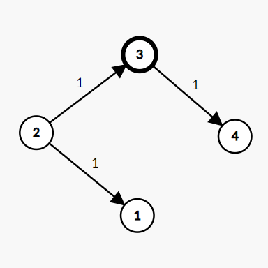

# **Alex Travelling**

## **Medium**

Alex is very fond of traveling. There are **n** cities, labeled from **1** to **n**. You are also given flights, a list of travel flights as **directed weighted** edges **flights\[i\] = (ui,vi,wi)** where **ui **is the source node, **vi** is the target node, and **wi** is the price it takes for a person to travel from source to target.  
Currently, Alex is in **k**'th city and wants to visit one city of his choice. Return the **minimum** money Alex should have so that he can visit any city of his choice from **k**'th city. If there is a city that has no path from **k**'th city, which means Alex can't visit that city, return **-1**.  
Alex always takes the optimal path. He can any city via another city by taking multiple flights.

**Example 1:**

```
Input:
n: 4
k: 2
flights size: 3
flights: [[2,1,1],[2,3,1],[3,4,1]]
Output:
2
Explanation:
to visit 1 from 2 takes cost 1
to visit 2 from 2 takes cost 0
to visit 3 from 2 takes cost 1
to visit 4 from 2 takes cost 2,
2->3->4
So if Alex wants to visit city 4
from 2, he needs 2 units of money
```


**Example 2:**

```
Input:
n: 4
k: 3
flights size: 3
flights: [[2,1,1],[2,3,1],[3,4,1]]
Output: -1
Explanation:
There is no direct or indirect path
to visit city 2 and 1 from city 3
```



**Your Task:**

You don't need to print or input anything. Complete the function **minimumCost()** which takes a flights array, an integer n and an integer k as the input parameters and returns an integer, denoting the **minimum** money Alex should have so that he can visit any city of his choice from k'th city.

**Expected Time Complexity:** O((V+E) log V), here V is number of cities and E is number of flights.  
**Expected Auxiliary Space**: O(V+E), here V is number of cities and E is number of flights.

**Constraints:**

- 2 &lt;= n &lt;= 500
- 1 &lt;= flights.length &lt;= 100000
- flights\[i\].length == 3
- 1 &lt;= ui, vi, k&lt;= n
- ui != vi
- 1 &lt;= wi &lt;= 100
- All the pairs (ui, vi) are **unique**. (i.e., no multiple edges)

> ### **Problem URL: [Alex Travelling](https://practice.geeksforgeeks.org/problems/alex-travelling/1)**
